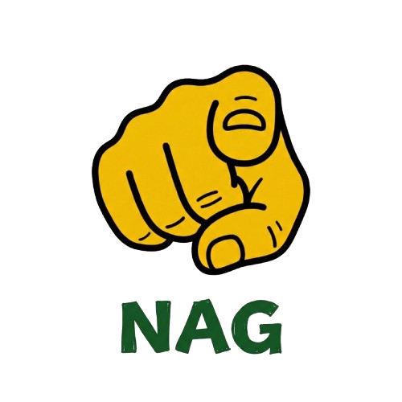
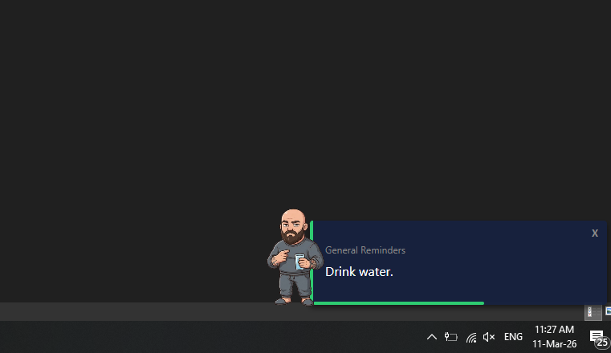

<p align="center">
  
</p>

# Nag

**Nag** is a cross-platform desktop app that sends you periodic notification popups with custom messages.
It sits quietly in your system tray and fires messages at intervals you control - perfect for reminders,
affirmations, motivation, or just annoying your friends.

Thought of making this for myself when I wanted to change my negative way of thinking and exposing myself randomly to things that made me uncomfortable (so positive 🤮). The fucking thing fires random messages and I can't do anything about it except close the app. It's fucking great.

---

## Quick Start

### Windows
Run `Nag-win-Setup.exe` to install. The app starts in your system tray.

### macOS / Linux
Extract the zip, then launch using the included helper script:

```bash
chmod +x start.sh
./start.sh
```

The `start.sh` script marks the `Nag` binary as executable and launches it for you.
On macOS you may also need to allow the app in **System Preferences > Security & Privacy**
the first time you run it.

The app creates its data files (`Categories/`, `Images/`, etc.) right next to the binary.

### First Steps
1. Right-click the tray icon to access the menu
2. Click **Settings** to configure frequency, active hours, and duration
3. Click **Fire Now** to see an instant preview

On first launch, a sample **Example** category is created for you automatically.

---

## How It Works

```
  System Tray
      |
      v
  [Nag Engine] --reads--> messages.json --picks--> Random Message
      |                                                  |
      v                                                  v
  Scheduler                                    Notification Popup
  (interval + active hours)                    (message + avatar)
```

The app reads `messages.json` for its message pool, picks a random one based on category weights,
and shows it as a desktop notification. Messages auto-dismiss after a configurable duration.

---

## Tray Menu

| Menu Item          | What it does                                       |
|--------------------|----------------------------------------------------|
| **Fire Now**       | Show a notification right now                      |
| **Pause / Resume** | Temporarily stop or restart the scheduler          |
| **Categories**     | Toggle individual categories on/off                |
| **Settings**       | Open the settings window                           |
| **Reload Messages**| Re-scan `Categories/` folder and sync to messages  |
| **Exit**           | Quit the app                                       |

---

## Settings

- **Frequency**: How often notifications fire (e.g. every 15-30 minutes)
- **Active Hours**: Only fire between these times (e.g. 9:00 AM - 10:00 PM)
- **Notification Duration**: How long the popup stays visible
- **Preview**: See exactly how a notification will look
- **Adjust Weights**: Control how often each category appears relative to others
- **Import Custom Pack**: Browse for a folder and import it as a new category

---

## Custom Categories

This is the main feature for personalizing Nag. There are two ways to add your own content:

### Method 1: Categories Folder (Recommended)

The `Categories/` folder is the friendly way to manage custom content.
Each subfolder becomes a message category:

```
Categories/
|-- My Reminders/
|   |-- avatar.png          <-- optional, shown on the notification
|   |-- messages.txt        <-- required, one message per line
|
|-- Friend Roasts/
|   |-- avatar.png
|   |-- messages.txt
|   |-- extra_messages.txt  <-- multiple .txt files are merged
|
|-- Quick Notes/
|   |-- messages.txt        <-- no avatar? that's fine, it just won't show one
```

**Rules:**
- Each subfolder = one category (folder name = category name)
- Must contain at least one `.txt` or `.json` file with messages
- `.txt` files: one message per line
- `.json` files: a JSON array of strings `["message 1", "message 2"]`
- One image file (`.png`, `.jpg`, `.jpeg`) = notification avatar
- Multiple images? First one found is used, rest are ignored
- No text files? Folder is skipped with a warning

**To apply changes:** Right-click the tray icon and hit **Reload Messages**.

### Method 2: Edit messages.json Directly

Power users can edit `messages.json` by hand. The format:

```json
{
  "categories": [
    {
      "id": "my-category",
      "name": "My Category",
      "enabled": true,
      "weight": 1,
      "messages": [
        "First message",
        "Second message"
      ]
    }
  ]
}
```

For avatars, use the `Categories/` folder approach (Method 1) — the app automatically
copies images from there into its internal `Images/` folder on Reload.

**To apply changes:** Right-click the tray icon and hit **Reload Messages**.

---

## Sharing with Friends

Want to create a message pack for someone else? Just create a folder:

```
MyPack/
|-- Category Name/
|   |-- avatar.png
|   |-- messages.txt
```

Your friend can import it via **Settings > Import Custom Pack** or manually
copy it into their `Categories/` folder and hit **Reload Messages**.

---

## Migration Script (Windows only)

Already have a `messages.json` with content and want to convert it to the
`Categories/` folder structure? Use the included `migrate_to_categories.ps1`:

```powershell
powershell -ExecutionPolicy Bypass -File migrate_to_categories.ps1
```

Run it from the app's install directory (where `messages.json` lives).
It creates a folder per category with `messages.txt` and copies any
existing avatars from `Images/`. Then hit **Reload Messages** in the app.

> This script is only included in the Windows distribution. On macOS/Linux,
> create `Categories/` folders manually or edit `messages.json` directly.

---

## File Structure

After first launch, the app directory looks like this:

```
Nag/
|-- Nag (or Nag.exe on Windows) <-- the app
|-- start.sh                    <-- launcher script (macOS/Linux)
|-- messages.json               <-- runtime message store
|-- settings.json               <-- your preferences
|-- app_logo.png                <-- app icon resource
|-- README.md                   <-- this file
|
|-- Categories/                 <-- created on first launch
|   |-- Example/
|       |-- avatar.png
|       |-- messages.txt
|
|-- Images/                     <-- created on first launch
|   |-- (category avatars are placed here automatically)
```

Windows also includes `migrate_to_categories.ps1` for converting existing
`messages.json` content into the `Categories/` folder structure.

---

## Troubleshooting

**App doesn't start / nothing happens:**
Only one instance can run at a time. Check your system tray for an existing icon.

**Notifications not appearing:**
- Make sure the app isn't paused (check tray menu)
- Verify at least one category is enabled (tray > Categories)
- Check that Active Hours cover the current time (Settings)

**Imported category not showing up:**
- Folder must contain at least one `.txt` or `.json` file
- Hit **Reload Messages** after adding/removing folders
- Check the sync notification for warnings or errors

**Want to fully uninstall:**
The uninstaller removes the app, but user data (messages, categories, settings)
is kept in case you reinstall. To fully clean up, delete the install folder
(usually `%LocalAppData%\Nag`).

---

## What It Looks Like

<p align="center">
  
</p>

---

## Making It Yours

The whole point of Nag is to hit you with **your own** messages and imagery.
Here's how to make it personal.

### Writing Your Messages

Your `messages.txt` is just one message per line. Some ideas to get started:

- **Affirmations**: Stuff you need to hear but won't say to yourself
- **Reality checks**: Counter-arguments to negative thought patterns
- **Compliments**: Things people have actually said about you (write them down!)
- **Defiance**: Aggressive positivity — sometimes "fuck that voice in your head" works better than "you are worthy"
- **Reminders**: Drink water. Stand up. Breathe. Text that person back.
- **Inside jokes**: Stuff that makes you smile even when you don't want to

Mix tones. Serious and silly in the same category keeps it unpredictable.

### Creating Avatar Images

Each category can have an avatar that appears alongside your notifications.
The image overlaps slightly with the message text, so it looks like a little
companion attached to the message — not a separate element.

**For this to look good, use images with transparent backgrounds.**

Here's why: a solid background (white, colored, etc.) creates a harsh box
that covers part of your message. A transparent background lets the image
blend naturally into the notification.

#### Step 1: Generate an Image (Free AI Tools)

You don't need to be an artist. These tools generate images for free:

| Tool | Link | Notes |
|------|------|-------|
| **ChatGPT** (DALL-E) | [chat.openai.com](https://chat.openai.com) | Free tier includes image generation |
| **Microsoft Copilot** | [copilot.microsoft.com](https://copilot.microsoft.com) | Free, uses DALL-E under the hood |
| **Google Gemini** | [gemini.google.com](https://gemini.google.com) | Free image generation built in |
| **Grok** | [x.com/i/grok](https://x.com/i/grok) | Free on X (Twitter), uses Aurora |
| **Meta AI** | [meta.ai](https://meta.ai) | Free, generates images in chat |
| **Ideogram** | [ideogram.ai](https://ideogram.ai) | Free tier, great with text in images |
| **Leonardo AI** | [leonardo.ai](https://leonardo.ai) | Free tier with daily credits |

#### Step 2: Use the Right Prompt

When generating your image, ask for a **solid white background** with no other
white elements in the image itself. This makes the background removal (Step 3)
clean and artifact-free.

**Example prompt:**
> A cute cartoon cat wearing boxing gloves, in a fighting stance, vibrant colors,
> on a solid pure white background. No shadows, no gradients, no other white
> elements in the image.

The key phrases are:
- `solid pure white background`
- `no shadows, no gradients`
- `no other white elements in the image`

#### Step 3: Remove the Background

Take your generated image to **[remove.bg](https://www.remove.bg/)** — it's
free and removes backgrounds in seconds. Download the result as PNG
(transparency is preserved in PNG format, not JPG).

#### Step 4: Drop It In

Save the transparent PNG as `avatar.png` in your category folder:

```
Categories/
|-- My Category/
|   |-- avatar.png      <-- your transparent image
|   |-- messages.txt
```

Hit **Reload Messages** and fire a test notification to see it in action.

### Image Tips

- **Size doesn't matter much** — the app resizes automatically, but roughly
  square images (e.g. 256x256, 512x512) work best
- **PNG only for transparency** — JPG doesn't support transparent backgrounds
- **Keep it simple** — detailed/busy images get lost at notification size.
  Bold shapes and bright colors read best at a glance
- **One per category** — if you drop multiple images, only the first one found
  is used

### Sharing Packs with Friends

Made something cool? Zip up your category folder and send it:

```
MyAwesomePack/
|-- avatar.png
|-- messages.txt
```

They drop it into their `Categories/` folder, hit Reload, done.
Mix and match — everyone's Nag becomes their own weird little thing.

---

## License

Free for personal use — use it, fork it, change it. Just don't sell it. See [LICENSE](LICENSE) for details.
